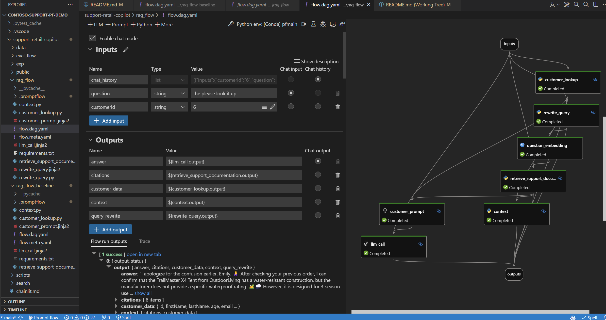
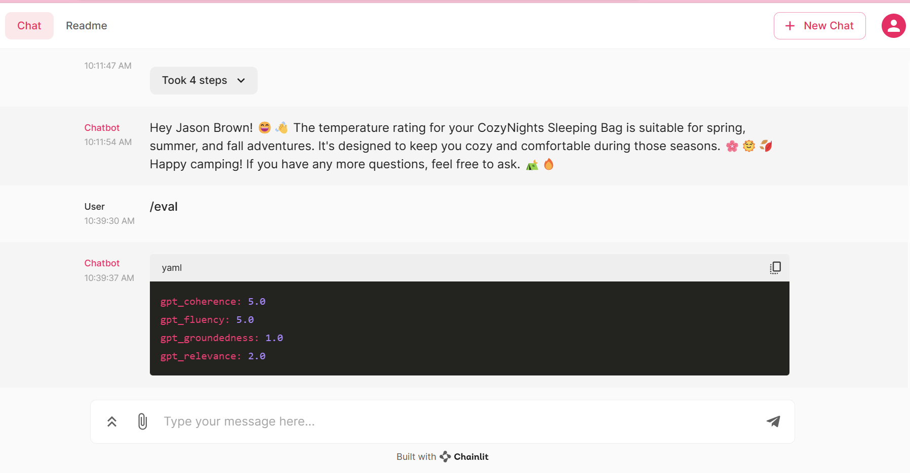

# Contoso Support Chat Prompt Flow Demo

This repository hosts the code used in the [MS Ignite 2023 | Live Breakout Session | BRK203](https://ignite.microsoft.com/en-US/sessions/16ee2bd5-7cb8-4419-95f6-3cab36dfac93)

**End-to-End AI App Development: Prompt Engineering to LLMOps**

## Introduction

Prompt engineering and LLMOps are pivotal in maximizing the capabilities of Language Models (LLMs) for specific business needs. This code base is from the End-to-End AI App Development: Prompt Engineering to LLMOps Microsoft Ignite session. We'll walk you through the entire process—from prototyping and experimenting to evaluating and deploying your AI-powered apps. Learn how to streamline your AI workflows and harness the full potential of Generative AI.

### Prerequisites

- [Azure Subscription](https://azure.microsoft.com/free/)
- [VS Code](https://code.visualstudio.com/download)
- [Prompt Flow Extension](https://marketplace.visualstudio.com/items?itemName=prompt-flow.prompt-flow)
- [anaconda](https://www.anaconda.com/products/individual) or [venv](https://docs.python.org/3/library/venv.html) to manage python environments.

## Getting Started

### Clone the repo

```bash
git clone https://github.com/microsoft/contoso-support-pf-demo.git
```

### Open the repo in VS Code

```bash
cd contoso-support-pf-demo
code .
```

### Install the Prompt Flow Extension

- Open the VS Code Extensions tab
- Search for "Prompt Flow"
- Install the extension

### Create a new python environment

#### Using anaconda

```bash
conda create -n contoso-support-pf-demo python=3.8
conda activate contoso-support-pf-demo
pip install -r requirements.txt
```

#### Using venv

```bash
python3 -m venv contoso-support-pf-demo
source contoso-support-pf-demo/bin/activate
pip install -r requirements.txt
```

### Create data resources to be used in the prompt flow

- Azure AI Search - [Create an Azure Cognitive Search service](https://docs.microsoft.com/en-us/azure/search/search-create-service-portal)
The Azure AI Search connection is used to do vector lookups and return the information from the Azure AI Search index. The Azure AI Search index is created from the data in the `data/product_info` folder with the `script\create_index.sh`.


- Azure Open AI Connection - [Create an Azure Open AI Connection](https://learn.microsoft.com/en-us/azure/ai-services/openai/how-to/create-resource?pivots=web-portal)
The Azure Open AI connection is used to create the endpoints for GPT-3 and GPT-4 as well as the embeddings model.

- Azure Cosmos DB - [Create an Azure Cosmos DB](https://docs.microsoft.com/en-us/azure/cosmos-db/create-cosmosdb-resources-portal)
The Azure Cosmos DB connection is used to store the customer data needed to lookup the customer information and return the information to be populated in the prompt.

### Setup the Connections
To run the prompt flow, the connections need to be set up. These can be setup as local connections or with the json confirguration connected to your workspace.

 - To setup local connections follow the instructions [here](https://microsoft.github.io/promptflow/how-to-guides/manage-connections.html)
 - To setup json connection follow the insturctions [here](https://microsoft.github.io/promptflow/cloud/azureai/consume-connections-from-azure-ai.html)

### Building a Prompt flow

Now that the environment, extensions, and connections have been installed we can open up the prompt flow and take a look at what it does.

- Click on the flow.dag.yaml file in the explorer. If everything was installed and the python environment was activated you should see the following and select `visual editor` to view the propmt flow:


- When the flow opens you should see the following:



- To learn how to build this flow from scratch, [check out the session and Microsoft Ignite.](https://ignite.microsoft.com/sessions/16ee2bd5-7cb8-4419-95f6-3cab36dfac93?source=sessions)

### Running Chainlit App Evaluation Tool

Once everything has been setup you can run the evaluation tool to evaluate the prompt flow. To run the evaluation tool, run the following command in the terminal:

```bash
cd contoso-support-pf-demo\support-retail-copilot
chainlit run app.py -w
```


## Contributing

This project welcomes contributions and suggestions.  Most contributions require you to agree to a
Contributor License Agreement (CLA) declaring that you have the right to, and actually do, grant us
the rights to use your contribution. For details, visit https://cla.opensource.microsoft.com.

When you submit a pull request, a CLA bot will automatically determine whether you need to provide
a CLA and decorate the PR appropriately (e.g., status check, comment). Simply follow the instructions
provided by the bot. You will only need to do this once across all repos using our CLA.

This project has adopted the [Microsoft Open Source Code of Conduct](https://opensource.microsoft.com/codeofconduct/).
For more information see the [Code of Conduct FAQ](https://opensource.microsoft.com/codeofconduct/faq/) or
contact [opencode@microsoft.com](mailto:opencode@microsoft.com) with any additional questions or comments.

## Trademarks

This project may contain trademarks or logos for projects, products, or services. Authorized use of Microsoft 
trademarks or logos is subject to and must follow 
[Microsoft's Trademark & Brand Guidelines](https://www.microsoft.com/en-us/legal/intellectualproperty/trademarks/usage/general).
Use of Microsoft trademarks or logos in modified versions of this project must not cause confusion or imply Microsoft sponsorship.
Any use of third-party trademarks or logos are subject to those third-party's policies.
